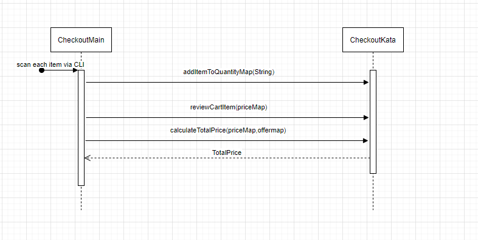

# CDL-Kata-Checkout-In-Java
Implement the code for a checkout system that handles pricing schemes such as “apples cost 50 pence, three apples cost £1.30.”

Implement the code for a supermarket checkout that calculates the total price of a number of items. In a normal supermarket, things are identified using Stock Keeping Units, or SKUs. In our store, we’ll use individual letters of the alphabet (A, B, C, and so on). Our goods are priced individually. In addition, some items are multi-priced: buy ‘n’ of them, and they’ll cost you ‘y’ pence. For example, item ‘A’ might cost 50 pence individually, but this week we have a special offer: buy three ‘A’s and they’ll cost you £1.30.

    Item  Price   Offer
    --------------------------
    A     50       3 for 130
    B     30       2 for 45
    C     20
    D     15

Our checkout accepts items in any order, so that if we scan a B, an A, and another B, we’ll recognize the two B’s and price them at 45 (for a total price so far of 95). Because the pricing changes frequently, we need to be able to pass in a set of pricing rules each time we start handling a checkout transaction.

The solution should allow for items to input at the command line, and allow for a final total to be calculated and for a running total after each item is ‘scanned’.

## **Solution:**

* Add items with their price in `price.prpoerties` file as key value pair
* Add special offers on the items in `offer.properties` file where key will be `itemName-quantity` and value will be discounted price.
* Update the ItemQuantityMap which contains each scanned item with their quantity by calling addItemToQuantityMap(item) method
* Review the Scanned item in the cart:

    a)If scanned item is not present in the supermarket(i.e in price.properties) then it will add in wronglyAddedItemList

    b)Removed wrong item from ItemQuantityMap

* Calculate the total price of cart.

Example :
Input1: A,B,A,C,B,A,D
Output: 210

input2: A,A
Output: 100

input3: A,B,A,B,A
Output: 175

## **Run locally:**

* 1)Add JDK1.8 jar in classpath
* 2)Add Junit jupiter jar in class path from [here](https://jar-download.com/artifacts/org.junit.jupiter/junit-jupiter-api)
* 3)Run CheckoutMain.java
* 4)Enter the items to be scanned for checkout (irrespective of order)
* 5)Enter `!!` ,when all items are scanned successfully. This will provide the total price.

